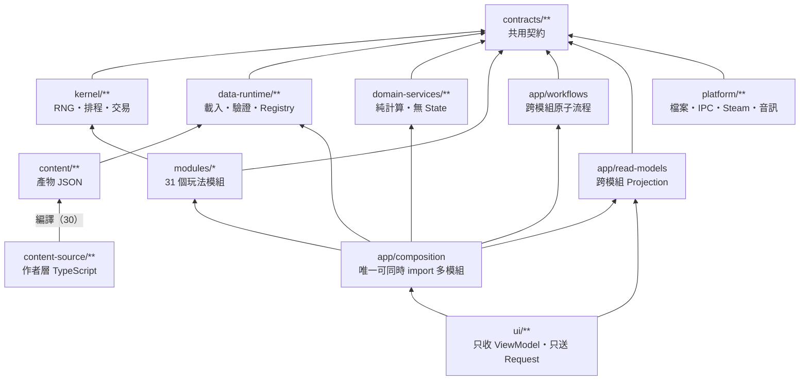
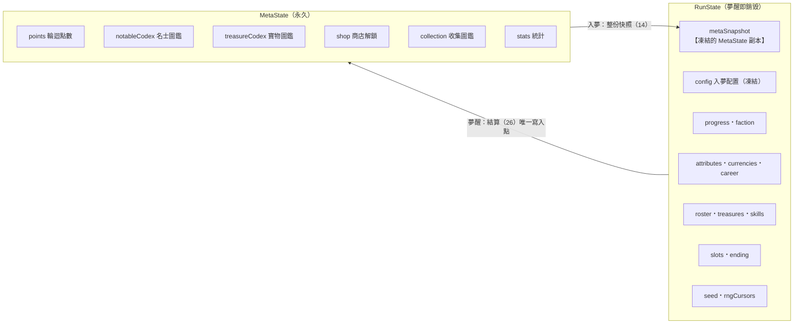
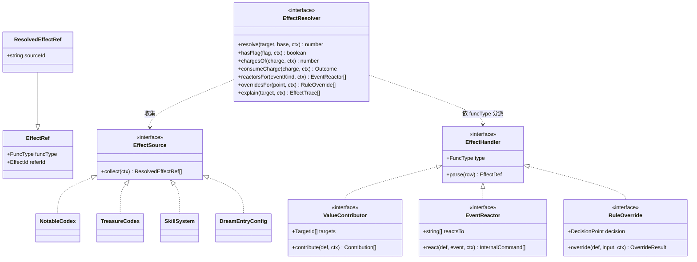
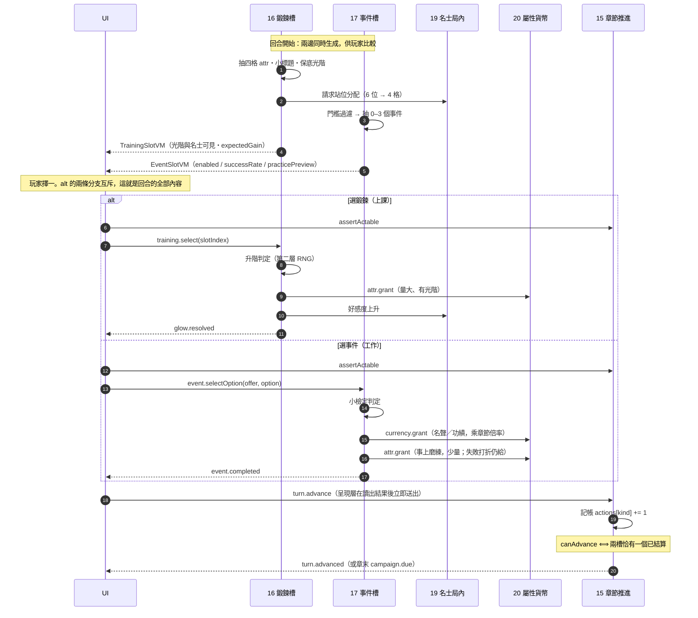
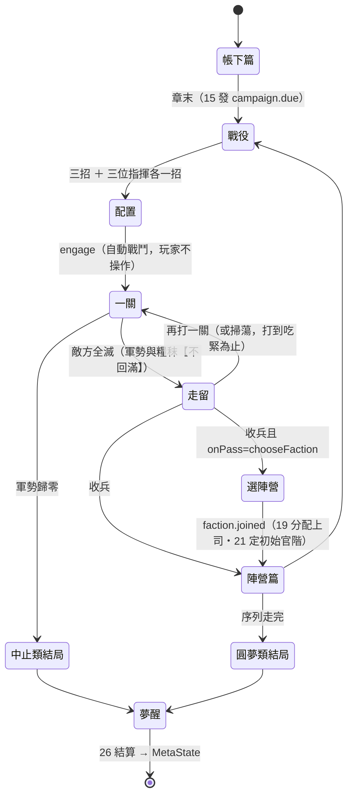
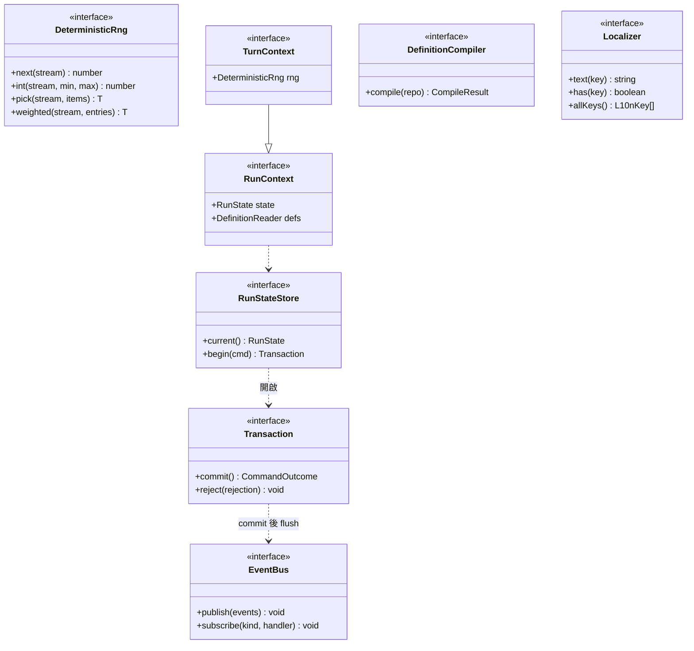
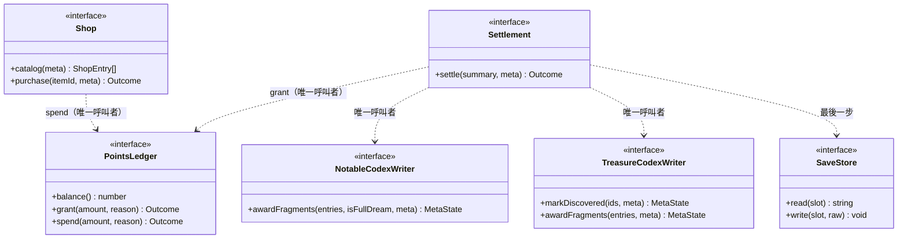
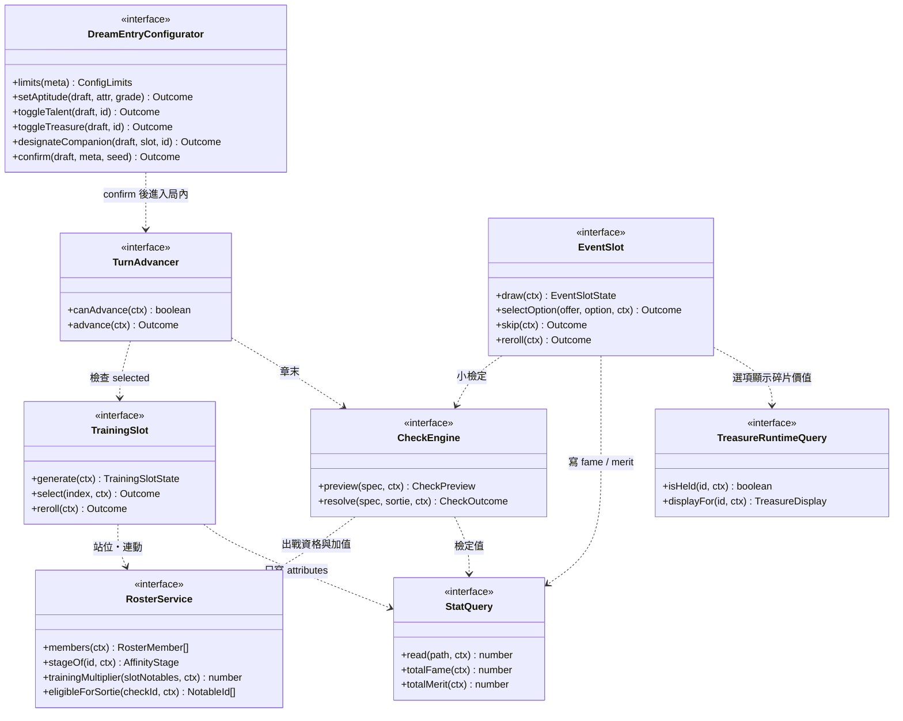
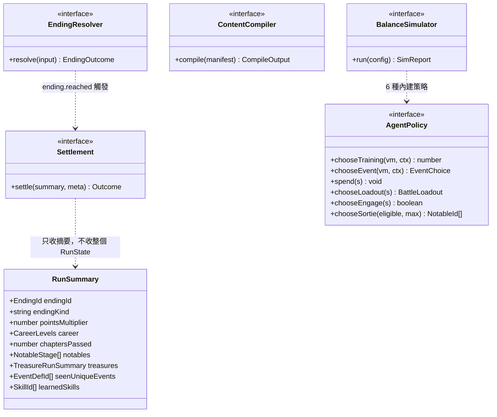

# 模組結構圖（UML）

> **定位**：33 個模組的依賴關係、狀態組成、介面骨架。細節見各模組契約。
>
> 決策記錄見 [RFC-01](../RFC-01-campaign-rework.md)。
> 圖以 mermaid 撰寫，在 GitHub 與 VS Code 預覽中會渲染。

---

## 1. 分層與依賴方向

箭頭方向 ＝ 依賴方向。**任兩個 `modules/` 之間沒有直接邊**，只能經 `contracts/`。

**由門禁強制的四條**：

- `modules/a` 不可 deep-import `modules/b`
- `ui/` 不可修改 State
- `platform/` 不可實作遊戲規則
- 依賴圖不得成環

---

## 2. 兩層狀態與唯一交接點

這是本專案最與眾不同的結構：存檔有**兩份狀態**，生命週期完全不同。

**三條方向規則（門禁可檢查）**：

| 規則 | 違反的後果 |
|---|---|
| 局內模組只讀 `metaSnapshot`，不得 import 活的 MetaState | 可重播破功 |
| 局內模組不得寫 MetaState | 結算不再是唯一交接點 |
| 只有 26 可同時持有 RunState 與活的 MetaState | — |

**為什麼要整份快照而不是引用**：玩家夢醒後在商店買了升階機率，再用同一 seed replay 上一場夢——若讀活的 MetaState，結果會不一樣。快照讓每個 Run 自我封閉，也讓平衡模擬器只需餵一份快照就能跑。

---

## 3. 效果系統（模組 ①）

所有加成的唯一表述與結算路徑。**新增一種來源 ＝ 新增一個 `EffectSource` 實作 ＋ 一份資料，管線與消費端不動。**

**兩條刻意的界線**：

1. **`supersedes` 過濾在來源模組做**，不進管線。否則管線得認識名士、天賦、寶物各自的規則，變成上帝物件
2. **整合點用介面分類，不用 Visitor 雙分派**。型別集合會持續增長，Visitor 會讓「新增效果」變成散彈式修改

---

## 4. 局內回合：單動作制

鍛鍊與事件是**同一個動作槽的兩邊**。兩者同時生成、同畫面呈現，但一回合只能投一個（15 §2）。

---

## 5. 章節與戰役的職責切分

15 只宣告「章末到了」，33 才打仗。這讓「回合怎麼走」與「仗怎麼打」可獨立實作與測試。

**沒有及格線**：`clearedStages === 0` 時收兵也是合法的（按兵不動）——
它拿不到任何獎勵，但章節照過。**沒有任何一條路能殺死你，除了你自己按下「再打一關」。**

**跨關不回滿**是這張圖唯一的樞紐：若每關滿血重開，七個「走留」節點會塌成一個。

---

## 6. 橫切層骨架（① – ⑥）

**`RunContext` / `TurnContext` 分兩層是型別層面的保證**：拿到 `RunContext` 的程式摸不到 RNG，因此「效果結算不得引入隨機」不需要人工審查。

| 誰拿哪一種 | 模組 |
|---|---|
| `RunContext`（無 RNG） | ① 效果、⑳ 屬性貨幣、㉑ 官階、㉕ 結局、read-models |
| `TurnContext`（有 RNG） | ⑯ 鍛鍊槽、⑰ 事件槽、⑱ 檢定、⑲ 陣容組建、㉔ 寶物掉落 |

---

## 7. 元層骨架（⑦ – ⑬）

**`grant` 與 `spend` 各只有一個合法呼叫者**，由 Composition 註冊限制。這讓「產出總和 − 消耗總和 ＝ 餘額」成為可斷言的不變量，而 ⑬ 統計可獨立驗算（`pointsEarnedTotal − pointsSpentTotal === points`）。

---

## 8. 配置與局內層骨架（⑭ – ㉔）

**兩條產出分工的硬約束**：

| 模組 | 可寫 | 不可寫 |
|---|---|---|
| ⑯ 鍛鍊槽 | `attributes` | `currencies`（門禁可驗證） |
| ⑰ 事件槽 | `currencies`、`attributes`（**少量**：事上磨練與劇情獎勵） | — |

若讓鍛鍊也給功績，玩家可以靠猛練繞過事件系統升官，門檻貨幣的設計會被稀釋、事件槽失去存在意義。

反向則不對稱：**事件可以給四維，但必須少**（17 §6.2）。單動作回合制下事件要花掉
一整個鍛鍊回合，若完全不給四維，做事就等於純落後；若給得跟鍛鍊一樣多，鍛鍊槽
就失去存在意義。兩張成長曲線的 `baseByAttr` 比值是這個平衡的唯一旋鈕。

**`StatQuery` 是唯一門檻查詢入口**：六個模組（①⑰⑱㉑㉒㉕）都經它取值，因此「總名聲」的定義只有一份。

---

## 9. 結束層與工具鏈骨架（㉕ – ㉛）

**`Settlement` 只收 `RunSummary` 不收整個 `RunState`**：讓「結算需要什麼」變成明確契約——加一個結算輸入就要改摘要型別，而那會強制檢視所有提供者。

**㉛ 平衡模擬器決定了一條架構約束**：它要能跑，核心就不能依賴 React 或 Electron。反過來說——**模擬器跑不起來，就代表核心的解耦失敗了**。它同時是架構正確性的驗證工具。

---

## 10. 模組總表

| # | 模組 | 層 | State Slice | 契約 |
|---|---|---|---|---|
| ① | 效果系統 | 橫切 | — | [01](01_effect_system.md) |
| ② | Data Runtime | 橫切 | — | [02](02_data_runtime.md) |
| ③ | RunState | 橫切 | 容器本身 | [03](03_run_state.md) |
| ④ | RNG | 橫切 | `seed`・`rngCursors` | [04](04_rng.md) |
| ⑤ | 事件匯流排 | 橫切 | — | [05](05_event_bus.md) |
| ⑥ | 本地化 | 橫切 | — | [06](06_localization.md) |
| ⑦ | 存檔 | 元 | 檔案格式 | [07](07_save.md) |
| ⑧ | 輪迴點數 | 元 | `points` | [08](08_reincarnation_points.md) |
| ⑨ | 天命商店 | 元 | `shop` | [09](09_destiny_shop.md) |
| ⑩ | 名士圖鑑 | 元 | `notableCodex` | [10](10_notable_codex.md) |
| ⑪ | 寶物圖鑑 | 元 | `treasureCodex` | [11](11_treasure_codex.md) |
| ⑫ | 收集圖鑑 | 元 | `collection` | [12](12_collection_codex.md) |
| ⑬ | 成就統計 | 元 | `stats` | [13](13_achievements.md) |
| ⑭ | 入夢配置 | 配置 | `config`（凍結） | [14](14_dream_entry_config.md) |
| ⑮ | 章節回合 | 局內 | `progress` | [15](15_chapter_turn.md) |
| ⑯ | 鍛鍊槽 | 局內 | `slots.training` | [16](16_training_slot.md) |
| ⑰ | 事件槽 | 局內 | `slots.event` | [17](17_event_slot.md) |
| ⑱ | 檢定引擎 | 局內 | — | [18](18_check_engine.md) |
| ⑲ | 名士局內 | 局內 | `roster` | [19](19_notable_runtime.md) |
| ⑳ | 屬性貨幣 | 局內 | `attributes`・`currencies` | [20](20_attributes_currency.md) |
| ㉑ | 官階系統 | 局內 | `career` | [21](21_career_rank.md) |
| ㉒ | 陣營系統 | 局內 | `faction` | [22](22_faction.md) |
| ㉓ | 特質與技能 | 局內 | `abilities` | [23](23_skill.md) |
| ㉔ | 寶物局內 | 局內 | `treasures` | [24](24_treasure_runtime.md) |
| ㉕ | 結局判定 | 結束 | `ending` | [25](25_ending.md) |
| ㉖ | 結算產出 | 結束 | — | [26](26_settlement.md) |
| ㉗ | 畫面路由 | 呈現 | 畫面狀態機 | [27](27_screen_routing.md) |
| ㉘ | 文本模板 | 呈現 | — | [28](28_text_template.md) |
| ㉙ | 音效音樂 | 呈現 | — | [29](29_audio.md) |
| ㉚ | 內容編譯器 | 工具 | — | [30](30_content_compiler.md) |
| ㉛ | 平衡模擬器 | 工具 | — | [31](31_balance_simulator.md) |
| **㉜** | **養成兌現** | 局內 | `growth` | [32](32_growth_conversion.md) |
| **㉝** | **戰役** | 局內 | `campaign` | [33](33_campaign.md) |
